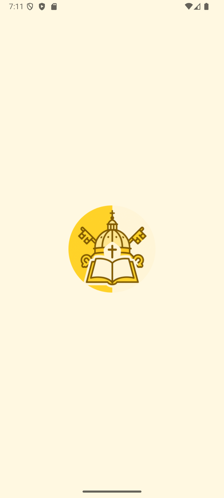
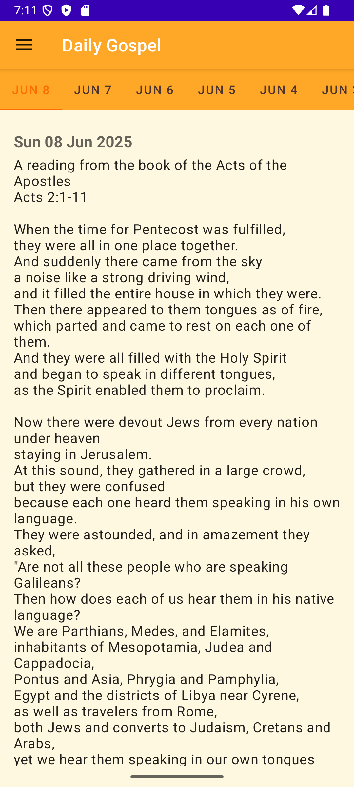
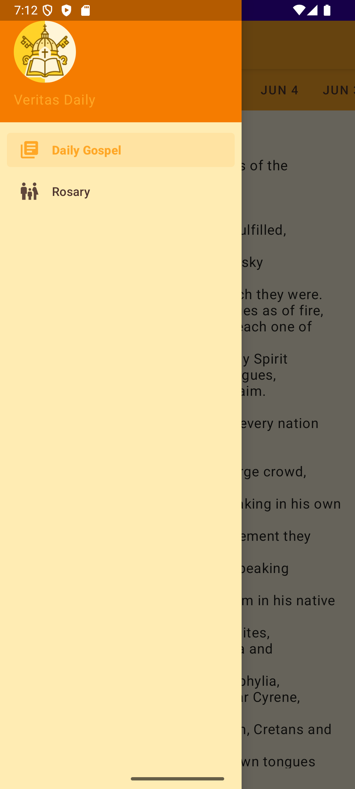
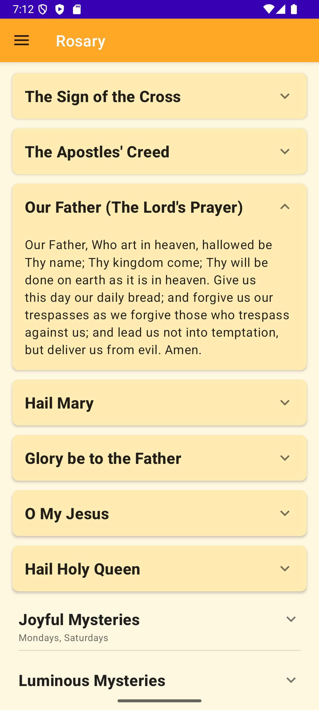
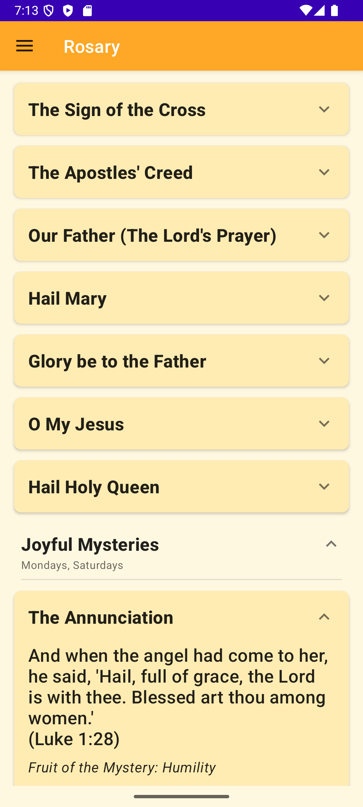

# Veritas Daily - Android App

[](https://github.com/hashansilva/BibleMate/actions/workflows/android_build.yml)
[](https://github.com/hashansilva/BibleMate/actions/workflows/android_lint.yml)
[](https://github.com/hashansilva/BibleMate/actions/workflows/github-code-scanning/codeql)
[](https://github.com/hashan-silva/BibleMate/actions/workflows/sonarcloud.yml)
[](https://sonarcloud.io/summary/new_code?id=hashan-silva_BibleMate)

**Veritas Daily** is a spiritual companion Android application for daily prayer and reflection. It
includes features such as the Holy Rosary, Daily Gospel readings (sourced from Vatican News), and an
About section for more context on its usage and content.

---

## Table of Contents

- [Features](#features)
- [Screenshots](#screenshots)
- [Tech Stack & Architecture](#tech-stack--architecture)
- [Setup & Build](#setup--build)
    - [Prerequisites](#prerequisites)
    - [Cloning](#cloning)
    - [Building](#building)
- [Project Structure](#project-structure)
- [Dependencies](#dependencies)
- [Contributing](#contributing)
- [License](#license)
- [Acknowledgments](#acknowledgments)

---

## Features

- **Daily Gospel:**
    - Displays daily gospel readings via Vatican News RSS feed.
    - Includes loading indicators and graceful error handling.

- **Holy Rosary:**
    - Interactive Rosary guide.
    - Includes all Mysteries (Joyful, Luminous, Sorrowful, Glorious).
    - Expandable prayer sections.

- **Navigation:**
    - Navigation Drawer for simple screen access.
    - Toolbar with options menu.

- **User Interface:**
    - Light and Dark Mode.
    - Based on Material Design.

- **About Page:**
    - Details about the app, data sources, and version info.

---

## Screenshots

<div align="center" style="display: flex; flex-wrap: wrap; justify-content: center; gap: 20px;">
    
    
    
    
    
</div>

---

## Tech Stack & Architecture

- **Language:** Kotlin
- **Architecture:** MVVM (Model-View-ViewModel)
- **Jetpack Components:**
    - **UI Layer:** Fragments, View Binding / Data Binding, RecyclerView, Navigation Component
    - **Data Layer:** Repository Pattern, Retrofit *(if used)*, Room *(if applicable)*
    - **Lifecycle:** ViewModel, LiveData / Kotlin Flows
- **Coroutines:** Kotlin Coroutines
- **DI (Dependency Injection):** *Specify if Hilt, Koin, or manual*
- **Testing Frameworks:** *Specify e.g., JUnit, Mockito, Espresso*

---

## Setup & Build

### Prerequisites

- Android Studio (2023.2.1+ Iguana)
- Android SDK (Target SDK: 35)
- JDK 17 or higher

### Cloning

```bash
git clone https://github.com/hashansilva/BibleMate.git
cd BibleMate
```

### Building

1. Open the project in Android Studio.
2. Let it sync Gradle and fetch dependencies.
3. Click **Run** or go to **Build > Make Project**.

#### Generate Signed APK/AAB

1. Follow the [official Android guide](https://developer.android.com/studio/publish/app-signing).
2. Use **Build > Generate Signed Bundle / APK...**

---

## Project Structure

```
BibleMate/
├── app/
│   └── src/
│       └── main/
│           ├── java/com/hashan0314/veritasdaily/
│           │   ├── model/
│           │   ├── network/
│           │   ├── repository/
│           │   └── ui/
│           │       ├── adapter/
│           │       ├── fragment/
│           │       ├── viewmodel/
│           │       └── MainActivity.kt
│           ├── res/
│           │   ├── layout/
│           │   ├── drawable/
│           │   ├── menu/
│           │   ├── navigation/
│           │   └── values/
│           └── AndroidManifest.xml
├── .github/
│   └── workflows/
│       └── android_build.yml
├── build.gradle
└── settings.gradle
```

---

## Dependencies

Key dependencies include:

- AndroidX Core Libraries
- Material Components
- Retrofit & OkHttp *(if used)*
- Gson / Moshi / Kotlinx Serialization *(if used)*
- Kotlin Coroutines
- Glide / Picasso *(if used)*

> Full list available in `app/build.gradle`.

---

## Code Quality

Pushes and pull requests to the **dev** and **master** branches trigger a
[SonarCloud](https://sonarcloud.io) analysis. Configure the `SONAR_TOKEN`
secret in your repository to enable the workflow.

The SonarCloud quality gate status is posted back on each pull request.

Android Lint checks run on pull requests targeting the **dev** or **master**
branch and comment lint issues with a link to the full report.

The SonarCloud quality gate status is posted back on each pull request.

Android Lint checks run on pull requests and comment lint issues with a link to the full report.

The SonarCloud quality gate status is posted back on each pull request.

Android Lint checks run on pull requests and comment lint issues with a link to the full report.

---


## Contributing

1. Fork the repo.
2. Create a branch: `git checkout -b feature/my-feature`
3. Commit changes: `git commit -m 'Added my feature'`
4. Push the branch: `git push origin feature/my-feature`
5. Open a Pull Request.

Make sure your code follows existing styles and includes relevant tests.

---

## License

This project is licensed under the **[Your License Here]**.  
See [LICENSE](LICENSE) for more information.

---

## Acknowledgments

- Daily Gospel from [Vatican News](https://www.vaticannews.va)
- Icons by [Material Design Icons](https://material.io/resources/icons/)
- Thanks to the open-source community and contributors!
